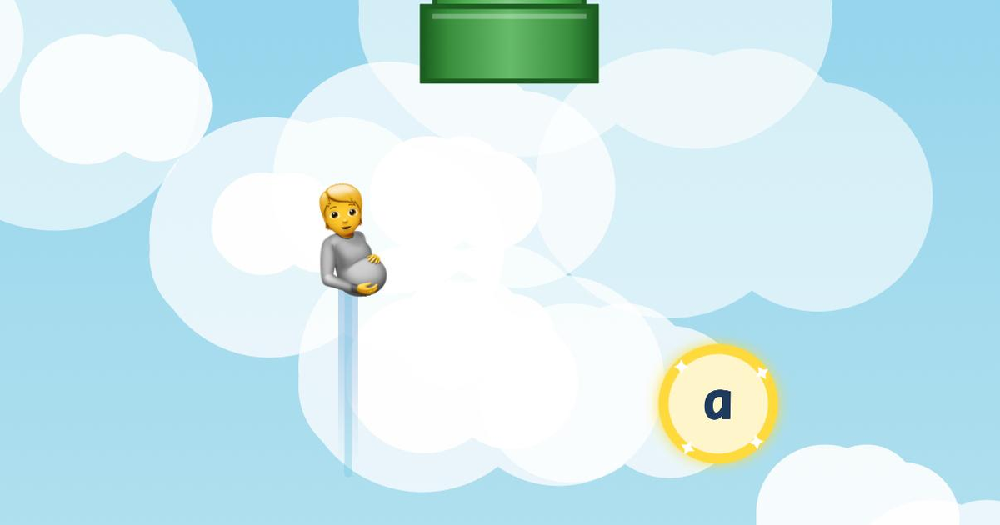

# Birdle

<p align="center">
  
</p>

A Flappy Bird-style word puzzle game. Create secret phrases, share them with friends, and challenge them to reveal the message!

## How It Works

1. **Create** - Enter a secret word or phrase and pick your character
2. **Share** - Send the generated link to friends
3. **Play** - Flap through obstacles, collect letters, reveal the phrase

## Game Mechanics

- **Flap** to stay airborne (tap/click or spacebar)
- **Collect letters** floating in the gaps between pipes
- **Avoid obstacles** - hitting pipes or screen edges resets progress
- **Guess early** - press G to guess the phrase before collecting all letters

## Tech Stack

- Vanilla JavaScript (ES6 modules)
- HTML5 Canvas 2D
- Vite

## Run Locally

```bash
npm install
npm run dev
```

---

[Play Birdle](https://birdlegame.me) ·  Built with ❤️
